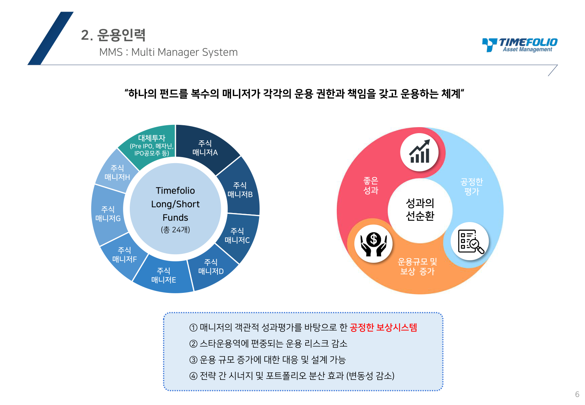

# PDF 제안서 제작 방법론 (운용사 자료 기반)

## 📋 프로젝트 개요
- **목적**: 타임폴리오 vs 디에스 사모펀드 비교 제안서 (A4 프린트용)
- **기술 스택**: HTML/CSS (프린트 최적화), Python (PyMuPDF)
- **특징**: 운용사 공식 자료 캡쳐, 심플 디자인, PDF 변환 가능

## 🗂️ 파일 구조
```
fund-comparison-web/
├── report.html                  # 최종 제안서 HTML
├── extract_pdf_pages.py         # PDF 페이지 추출 스크립트
└── images/                      # 추출된 이미지
    ├── timefolio_*.png          # 타임폴리오 이미지
    ├── ds_*.png                 # 디에스 이미지
    ├── fund_performance.png     # 펀드 성과 현황
    └── market_view.png          # 시장 전망
```

## 🔧 1단계: PDF 페이지 추출

### 필요한 라이브러리 설치
```powershell
pip install PyMuPDF pillow
```

### 추출 스크립트 (extract_pdf_pages.py)
```python
import fitz  # PyMuPDF
import os

output_dir = r"c:\dev\active-projects\fund-comparison-web\images"
os.makedirs(output_dir, exist_ok=True)

def extract_page_as_image(pdf_path, page_num, output_name):
    """PDF의 특정 페이지를 이미지로 추출"""
    try:
        doc = fitz.open(pdf_path)
        page = doc[page_num - 1]  # 0-based index
        
        # 고해상도로 렌더링 (200 DPI)
        mat = fitz.Matrix(2.0, 2.0)
        pix = page.get_pixmap(matrix=mat)
        
        output_path = f"{output_dir}/{output_name}.png"
        pix.save(output_path)
        doc.close()
        print(f"✓ {output_name} 저장 완료")
        return True
    except Exception as e:
        print(f"✗ {output_name} 처리 실패: {e}")
        return False

# 타임폴리오 추출
timefolio_pdf = r"C:\path\to\타임폴리오_통합PT.pdf"
extract_page_as_image(timefolio_pdf, 2, "timefolio_performance")
extract_page_as_image(timefolio_pdf, 6, "timefolio_mms")
extract_page_as_image(timefolio_pdf, 8, "timefolio_tms")

# 디에스 추출
ds_pdf = r"C:\path\to\디에스_제안서.pdf"
extract_page_as_image(ds_pdf, 7, "ds_philosophy")
extract_page_as_image(ds_pdf, 13, "ds_4factor")
extract_page_as_image(ds_pdf, 22, "ds_spectrum")
```

### 실행
```powershell
python extract_pdf_pages.py
```

## 📄 2단계: HTML 제안서 작성

### 기본 구조
```html
<!DOCTYPE html>
<html lang="ko">
<head>
    <meta charset="UTF-8">
    <title>사모펀드 투자 제안서</title>
    <style>
        @page { size: A4; margin: 0; }
        * { margin: 0; padding: 0; box-sizing: border-box; }
        body { font-family: 'Malgun Gothic', sans-serif; background: white; }
        .page { 
            width: 210mm; 
            min-height: 297mm; 
            padding: 15mm; 
            margin: 0 auto; 
            background: white; 
            page-break-after: always; 
        }
        .page:last-child { page-break-after: auto; }
        
        @media print {
            body { margin: 0; }
            .page { margin: 0; page-break-after: always; }
        }
        
        h1 { 
            font-size: 20pt; 
            font-weight: bold; 
            margin-bottom: 8mm; 
            border-bottom: 2pt solid #000; 
            padding-bottom: 4mm; 
        }
        h2 { 
            font-size: 14pt; 
            font-weight: bold; 
            margin: 6mm 0 3mm 0; 
        }
        img { 
            width: 100%; 
            height: auto; 
            margin: 2mm 0; 
            border: 1px solid #ddd; 
        }
    </style>
</head>
<body>
    <div class="page">
        <h1>타임폴리오 - 운용 전략</h1>
        <h2>MMS (Multi Manager System)</h2>
        
    </div>
</body>
</html>
```

## 🎨 디자인 원칙

### 1. 프린트 최적화
- **A4 크기**: `210mm x 297mm`
- **여백**: `15mm` (상하좌우)
- **페이지 구분**: `page-break-after: always`

### 2. 폰트 크기
```css
h1: 20pt    /* 페이지 제목 */
h2: 14pt    /* 섹션 제목 */
p:  10pt    /* 본문 */
li: 9pt     /* 리스트 */
```

### 3. 이미지 처리
- **너비**: `100%` (페이지 전체 너비)
- **높이**: `auto` (비율 유지)
- **여백**: `2mm` (상하)
- **테두리**: `1px solid #ddd` (구분선)

### 4. 텍스트 박스
```css
.text-box {
    background: #f9f9f9;
    padding: 4mm;
    margin: 2mm 0;
    border-left: 3pt solid #333;
}
```

## 📊 페이지 구성 전략

### 타임폴리오 (4페이지)
1. **비교 & 성과**: 핵심 비교표 + 10년 성과 차트
2. **운용 전략**: Long/Short 구조 + 운용철학
3. **운용 시스템**: MMS + TMS
4. **시장 전망**: Why Now? + 2026 전망

### 디에스 (5페이지)
1. **운용 철학**: 투자 스타일 + 핵심 전략
2. **세부 전략**: 대형/중소형 비중 + 성장 산업
3. **투자 프로세스**: 4-Factor + 종목 선정
4. **투자 사례**: 실제 투자 사례 2건
5. **시장 전망**: Market View + 투자 스펙트럼

### 종합 (1페이지)
- **시장 전망**: 2026년 전망
- **배분 전략**: 공격형/중립형/안정형

## 🖨️ PDF 변환 방법

### 방법 1: 브라우저 인쇄
1. HTML 파일을 브라우저에서 열기
2. `Ctrl + P` (인쇄)
3. "대상: PDF로 저장"
4. "여백: 없음" 선택
5. 저장

### 방법 2: wkhtmltopdf (자동화)
```powershell
# 설치
choco install wkhtmltopdf

# 변환
wkhtmltopdf report.html report.pdf
```

### 방법 3: Python (자동화)
```python
from weasyprint import HTML

HTML('report.html').write_pdf('report.pdf')
```

## 📝 추출할 주요 페이지

### 타임폴리오 통합PT
- Page 2: Performance (10년 성과)
- Page 3: 전략 개요 (Long/Short)
- Page 5: 운용 철학
- Page 6: MMS
- Page 8: TMS
- Page 10-11: 시장 전망

### 디에스 제안서
- Page 7: 운용철학
- Page 8: 핵심전략
- Page 9: 세부전략
- Page 10-11: 성장 산업
- Page 13: 4-Factor
- Page 14-15: 투자사례
- Page 16: Market View
- Page 22: 투자 스펙트럼

### 기타 자료
- 주요펀드_수익률_현황.pdf: Page 1
- 시황자료.pdf: Page 1

## 🔄 업데이트 프로세스

### 1. 새로운 운용사 자료 입수
```powershell
# 1. PDF 파일을 금상 폴더에 저장
# 2. extract_pdf_pages.py 수정 (페이지 번호 확인)
# 3. 스크립트 실행
python extract_pdf_pages.py
```

### 2. HTML 수정
```html
<!-- 이미지 경로만 업데이트 -->

```

### 3. PDF 재생성
```powershell
# 브라우저에서 Ctrl + P → PDF 저장
```

## 💡 핵심 팁

### 1. 이미지 품질
- **DPI**: 200 이상 권장 (Matrix(2.0, 2.0))
- **포맷**: PNG (투명도 지원)
- **압축**: 가능하면 무손실

### 2. 페이지 레이아웃
- **제목**: 페이지당 1개 (h1)
- **섹션**: 2-3개 (h2)
- **이미지**: 1-2개 (페이지 분량 고려)

### 3. 텍스트 최소화
- 운용사 자료가 메인
- 텍스트는 보조 설명만
- 핵심 수치는 텍스트로 명시

### 4. 프린트 테스트
- 실제 프린트 전 PDF 미리보기
- 페이지 구분 확인
- 이미지 해상도 확인

## 🚀 빠른 시작 가이드

```powershell
# 1. 프로젝트 폴더 생성
mkdir fund-comparison-web
cd fund-comparison-web

# 2. Python 라이브러리 설치
pip install PyMuPDF

# 3. 추출 스크립트 작성
# extract_pdf_pages.py 생성

# 4. PDF 페이지 추출
python extract_pdf_pages.py

# 5. HTML 작성
# report.html 생성

# 6. 브라우저에서 확인
start report.html

# 7. PDF 변환
# Ctrl + P → PDF로 저장
```

## 📚 참고 자료
- PyMuPDF 문서: https://pymupdf.readthedocs.io/
- CSS Print: https://www.smashingmagazine.com/2015/01/designing-for-print-with-css/
- A4 크기: 210mm x 297mm (8.27" x 11.69")
